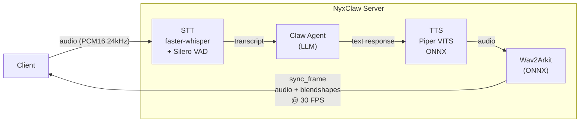
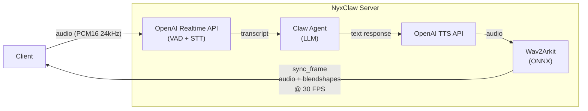

# NyxClaw

**Voice-to-avatar server for Claw-based AI agents**

> **Based on -> [Nyx Web Widget](https://myned.ai)**

[](LICENSE)
[](https://www.python.org/downloads/)

## What It Does

NyxClaw is a real-time WebSocket server that bridges a 3D real-time avatar frontend client and Claw-based AI backends (OpenClaw, ZeroClaw, etc). It runs the **Wav2Arkit ONNX** model on every audio chunk the backend produces, generating 52 ARKit facial blendshapes at 30 FPS, then streams synchronized `(audio + blendshape)` packets so the 3D avatar can lip-sync in real time on CPU.

Two voice pipelines are supported:

| | **Local Voice** (`VOICE_MODE=local`) | **OpenAI Voice** (`VOICE_MODE=openai`) |
|---|---|---|
| **STT** | faster-whisper + Silero VAD (CPU) | OpenAI Realtime API (server-side) |
| **TTS** | Piper VITS ONNX (CPU) | OpenAI TTS API |
| **Install** | `uv sync --extra local_voice` | `uv sync` (included by default) |
| **Requires** | ~1 GB of model downloads | `OPENAI_API_KEY` in `.env` |

Both pipelines run Wav2Arkit on every audio chunk for facial animation.

## Architecture

### Local Voice (`VOICE_MODE=local`)



### OpenAI Voice (`VOICE_MODE=openai`)



### Technology Stack

- **Runtime**: Python 3.10 / FastAPI (ASGI)
- **Protocol**: WebSocket (real-time), HTTP (health/auth)
- **Inference**: ONNX Runtime (CPU-optimized)
- **STT**: faster-whisper + Silero VAD (local) or OpenAI Realtime API
- **TTS**: Piper VITS ONNX (local) or OpenAI TTS API
- **Audio**: PCM 16-bit, 24 kHz, mono
- **Package Manager**: uv

### Core Modules

| Module | Description |
|--------|-------------|
| `src/main.py` | Entry point, middleware (CORS, auth), lifecycle |
| `src/chat/chat_session.py` | WebSocket session, audio playback, barge-in |
| `src/backend/` | Pluggable Claw backends (`BaseAgent` interface) |
| `src/voice/openai_realtime/` | OpenAI voice pipeline (Realtime API VAD+STT, TTS API) |
| `src/wav2arkit/` | ONNX model producing 52 ARKit blendshapes from audio |
| `src/services/stt_service.py` | Silero VAD (ONNX) + faster-whisper transcription |
| `src/services/tts_service.py` | Piper VITS ONNX text-to-speech |

## Quick Start

### Local Development

```bash
# 1. Install uv (if not already installed)
# Windows:
powershell -ExecutionPolicy ByPass -c "irm https://astral.sh/uv/install.ps1 | iex"
# macOS/Linux:
curl -LsSf https://astral.sh/uv/install.sh | sh

# 2. Clone and configure
git clone https://github.com/myned-ai/nyxclaw.git
cd nyxclaw
cp .env.example .env

# 3. Install dependencies
uv sync

# 4. Download the Wav2Arkit model (required for all voice modes)
mkdir -p pretrained_models/wav2arkit
uv run --with "huggingface_hub[cli]" huggingface-cli download myned-ai/wav2arkit_cpu --local-dir pretrained_models/wav2arkit
```

Now choose **one** of the two voice pipelines:

#### Option A: OpenAI Voice (easiest)

No model downloads needed — just add your API key:

```bash
# In .env, set:
VOICE_MODE=openai
OPENAI_API_KEY=sk-...
# + your Claw backend settings (AGENT_TYPE, BASE_URL, AUTH_TOKEN, AGENT_MODEL)
```

#### Option B: Local Voice (fully offline)

Install the local voice extra and download the models:

```bash
# Install local voice dependencies (~1 GB)
uv sync --extra local_voice

# Download faster-whisper model (CTranslate2 int8)
uv run python -c \
  "from faster_whisper.utils import download_model; download_model('small.en', output_dir='pretrained_models/faster_whisper_small_en')"

# Download Piper TTS voice
mkdir -p pretrained_models/piper
uv run --with huggingface_hub python -c "
import shutil; from huggingface_hub import hf_hub_download
for s in ('', '.json'):
    shutil.copy2(
        hf_hub_download('rhasspy/piper-voices', f'en_US-hfc_female-medium.onnx{s}',
            subfolder='en/en_US/hfc_female/medium'),
        f'pretrained_models/piper/en_US-hfc_female-medium.onnx{s}')
"

# In .env, set:
VOICE_MODE=local
# + your Claw backend settings (AGENT_TYPE, BASE_URL, AUTH_TOKEN, AGENT_MODEL)
```

#### Run

```bash
uv run python src/main.py
```

Server will start at `http://localhost:8080`

**Test the server:** Open `test.html` in your browser to test the [Avatar Chat Widget](https://github.com/myned-ai/avatar-chat-widget) with your local server. Make sure `AUTH_ENABLED=false` in your `.env` file for testing.

### Docker

```bash
# 1. Clone and configure
git clone https://github.com/myned-ai/nyxclaw.git
cd nyxclaw
cp .env.example .env
# Edit .env with your settings

# 2. Download the ONNX model
mkdir -p pretrained_models/wav2arkit
uv run --with "huggingface_hub[cli]" huggingface-cli download myned-ai/wav2arkit_cpu --local-dir pretrained_models/wav2arkit

# Optional: enable local voice build (faster-whisper / Piper TTS / Silero VAD)
# Add in .env before build: INSTALL_LOCAL_VOICE=true

# 3. Build and run (production — exposed on port 8081)
docker-compose up -d

# 4. View logs
docker-compose logs -f

# 5. Stop server
docker-compose down

# Development mode (with hot reload, port from SERVER_PORT env var)
docker-compose --profile dev up
```

## Configuration

All settings are configured via environment variables or `.env` file. See [.env.example](.env.example) for the full template.

## Auth Migration Docs

- Threat model: [`docs/auth/THREAT_MODEL.md`](docs/auth/THREAT_MODEL.md)
- Cutover runbook: [`docs/auth/STAGED_ROLLOUT.md`](docs/auth/STAGED_ROLLOUT.md)
- Mobile auth guide: [`docs/auth/MOBILE_APP_AUTH.md`](docs/auth/MOBILE_APP_AUTH.md)

### Agent Backend

| Variable | Default | Description |
|----------|---------|-------------|
| `AGENT_TYPE` | `openclaw` | LLM backend: `openclaw`, `zeroclaw` |
| `VOICE_MODE` | `local` | Voice pipeline: `local` (Piper TTS + faster-whisper) or `openai` (OpenAI Realtime + TTS API) |
| `BASE_URL` | `http://127.0.0.1:19001` | Agent backend URL |
| `AUTH_TOKEN` | *(none)* | Bearer token for agent authentication |
| `AGENT_MODEL` | `openclaw:main` | Model identifier for agent backend |
| `USER_ID` | *(none)* | Stable user ID for session continuity |
| `THINKING_MODE` | `minimal` | Thinking hint: `off`, `minimal`, `default` |
| `SESSION_KEY` | *(none)* | OpenClaw gateway routing override |
| `AGENT_ID` | *(none)* | OpenClaw agent ID override |
| `MAX_RETRIES` | `2` | Max retries for failed requests (OpenClaw) |

### OpenAI Voice (`VOICE_MODE=openai`)

| Variable | Default | Description |
|----------|---------|-------------|
| `OPENAI_API_KEY` | *(none)* | OpenAI API key (required) |
| `OPENAI_REALTIME_MODEL` | `gpt-realtime` | Realtime API model for VAD + STT |
| `OPENAI_VAD_TYPE` | `semantic_vad` | VAD type: `semantic_vad` or `server_vad` |
| `OPENAI_TRANSCRIPTION_MODEL` | `gpt-4o-transcribe` | Transcription model |
| `OPENAI_TRANSCRIPTION_LANGUAGE` | `en` | Transcription language |
| `OPENAI_TTS_MODEL` | `tts-1` | TTS model (`tts-1`, `tts-1-hd`) |
| `OPENAI_VOICE` | `alloy` | TTS voice (`alloy`, `echo`, `fable`, `onyx`, `nova`, `shimmer`) |
| `OPENAI_TTS_SPEED` | `1.0` | TTS speed (0.25 to 4.0) |

### Local Voice STT (`VOICE_MODE=local`)

| Variable | Default | Description |
|----------|---------|-------------|
| `STT_ENABLED` | `true` | Enable speech-to-text |
| `STT_MODEL` | `small.en` | faster-whisper model (`tiny.en`, `base.en`, `small.en`, `medium.en`) |
| `STT_VAD_START_THRESHOLD` | `0.60` | Silero VAD speech start threshold |
| `STT_VAD_END_THRESHOLD` | `0.35` | Silero VAD speech end threshold |
| `STT_VAD_MIN_SILENCE_MS` | `280` | Minimum silence before end-of-speech (ms) |
| `STT_INITIAL_PROMPT` | *(none)* | Whisper initial prompt for vocabulary priming |

### Local Voice TTS (`VOICE_MODE=local`)

| Variable | Default | Description |
|----------|---------|-------------|
| `TTS_ENABLED` | `true` | Enable text-to-speech |
| `TTS_ONNX_MODEL_DIR` | `./pretrained_models/piper` | Piper ONNX model directory |
| `TTS_VOICE_NAME` | `en_US-hfc_female-medium` | Piper voice name |
| `TTS_VOICE_PATH` | *(none)* | Path to WAV file for voice cloning |
| `TTS_NOISE_SCALE` | `0.75` | Audio variation (0=flat, 1=expressive) |
| `TTS_NOISE_W_SCALE` | `0.8` | Phoneme duration variation |
| `TTS_LENGTH_SCALE` | `0.95` | Speech speed (<1=faster, >1=slower) |

### Server & Auth

| Variable | Default | Description |
|----------|---------|-------------|
| `ASSISTANT_INSTRUCTIONS` | *see .env.example* | System prompt for the AI assistant |
| `ONNX_MODEL_PATH` | `./pretrained_models/wav2arkit/wav2arkit_cpu.onnx` | Wav2Arkit ONNX model path |
| `SERVER_HOST` | `0.0.0.0` | Server bind address |
| `SERVER_PORT` | `8080` | Server port |
| `DEBUG` | `false` | Enable debug logging |
| `AUTH_ENABLED` | `false` | Enable authentication enforcement |
| `AUTH_MODE` | `device_challenge_jwt` | Auth mode for mobile clients |
| `JWT_SIGNING_KEY` | *(empty)* | JWT signing secret (required when auth enabled) |
| `JWT_ISSUER` | `nyxclaw` | JWT issuer claim |
| `JWT_AUDIENCE` | `nyxclaw-mobile` | JWT audience claim |
| `JWT_ACCESS_TTL_SEC` | `120` | Access token lifetime in seconds |
| `JWT_REFRESH_TTL_SEC` | `2592000` | Refresh token lifetime in seconds |
| `AUTH_CHALLENGE_TTL_SEC` | `120` | Challenge nonce lifetime in seconds |
| `AUTH_REGISTRATION_POLICY` | `open` | Device registration policy (`open`, `invite`, `admin-approval`) |
| `AUTH_MAX_CLOCK_SKEW_SEC` | `30` | Allowed client/server time skew for signed payloads |
| `AUTH_MAX_SESSIONS_PER_DEVICE` | `5` | Max concurrent active sessions per device |

## Backend Setup

NyxClaw supports pluggable Claw backends. Set `AGENT_TYPE` in `.env` to switch between them.

### OpenClaw

The OpenClaw `/v1/chat/completions` endpoint must be **explicitly enabled** in `openclaw.json` before NyxClaw can communicate with the gateway.

In your `openclaw.json`:

```jsonc
{
  "gateway": {
    "http": {
      "endpoints": {
        "chatCompletions": {
          "enabled": true          // required for NyxClaw
        }
      }
    },
    "auth": {
      "token": "<your-token>"      // this value goes into AUTH_TOKEN in .env
    }
  }
}
```

Restart the OpenClaw container after editing, then verify:

```bash
curl -s -X POST http://localhost:19001/v1/chat/completions \
  -H "Content-Type: application/json" \
  -H "Authorization: Bearer <your-token>" \
  -d '{"model":"openclaw:main","messages":[{"role":"user","content":"hi"}],"stream":false}'
```

A `200` JSON response means it's working. A `405` means `chatCompletions` is still disabled.

`.env` for OpenClaw:

```dotenv
AGENT_TYPE=openclaw
BASE_URL=http://127.0.0.1:19001
AUTH_TOKEN=your-openclaw-token
AGENT_MODEL=openclaw:main
```

### ZeroClaw

```dotenv
AGENT_TYPE=zeroclaw
BASE_URL=http://127.0.0.1:5555
AUTH_TOKEN=your-zeroclaw-token
AGENT_MODEL=zeroclaw:main
```

### Custom Backends

Implement the `BaseAgent` interface in `src/backend/`:

```python
from backend import BaseAgent, ConversationState

class MyCustomBackend(BaseAgent):
    @property
    def is_connected(self) -> bool: ...

    @property
    def state(self) -> ConversationState: ...

    @property
    def transcript_speed(self) -> float: ...

    def set_event_handlers(self, **kwargs) -> None: ...

    async def connect(self) -> None: ...

    def send_text_message(self, text: str) -> None: ...

    def append_audio(self, audio_bytes: bytes) -> None: ...

    async def disconnect(self) -> None: ...
```

Then register it in `src/services/agent_service.py` and add the new `AGENT_TYPE` value.

## API

### HTTP Endpoints

| Method | Path | Description |
|--------|------|-------------|
| `GET` | `/inf` | Server info (name, version, status) |
| `GET` | `/health` | Health check (503 if unhealthy) |
| `POST` | `/api/auth/challenge` | Start device challenge auth |
| `POST` | `/api/auth/complete` | Complete challenge and issue access/refresh tokens |
| `POST` | `/api/auth/refresh` | Rotate refresh token and issue new access token |
| `POST` | `/api/auth/logout` | Revoke current session |
| `GET` | `/docs` | OpenAPI / Swagger UI |

### WebSocket (`/ws`)

Connect to `ws://localhost:8080/ws` (or `wss://` with TLS). When auth is enabled, pass `Authorization: Bearer <access_token>`.

**Client -> Server:**

| Type | Description |
|------|-------------|
| `audio_stream_start` | Start audio session (`userId` optional) |
| `audio` | Audio chunk — base64-encoded PCM16 24kHz mono |
| `text` | Text message to AI |
| `interrupt` | Stop AI response |
| `ping` | Keepalive |

**Server -> Client:**

| Type | Description |
|------|-------------|
| `config` | Audio settings (sent on connect) |
| `audio_start` | AI response turn started |
| `sync_frame` | Audio + 52 ARKit blendshapes (30 FPS) |
| `audio_chunk` | Audio-only fallback (no blendshape model) |
| `audio_end` | AI response turn finished |
| `transcript_delta` | Streaming text fragment |
| `transcript_done` | Complete turn transcript |
| `interrupt` | User interrupted AI — includes `offsetMs` cutoff |
| `avatar_state` | `"Listening"` or `"Responding"` |
| `pong` | Heartbeat response |

See the WebSocket protocol table above for message types and fields.

## Docker

### Multi-Stage Build

1. **Base**: Python 3.10-slim with system dependencies
2. **Dependencies**: Fast install with uv
3. **Production**: Minimal image, non-root user, health checks
4. **Development**: Hot reload support

### Production

```bash
docker build -t nyxclaw .

docker run -d \
  --name nyxclaw \
  -p 8080:8080 \
  --env-file .env \
  -v $(pwd)/pretrained_models:/app/pretrained_models:ro \
  --restart unless-stopped \
  nyxclaw
```

### Compose Profiles

- **Production**: `docker-compose up -d` (port 8081)
- **Development**: `docker-compose --profile dev up` (port from `SERVER_PORT`, default 8080)

### Resource Requirements

NyxClaw runs multiple ONNX models concurrently on CPU. With the full voice stack (`INSTALL_LOCAL_VOICE=true`):

| Component | Memory |
|-----------|--------|
| faster-whisper small.en (CTranslate2 int8) | ~500 MB |
| Piper TTS VITS ONNX | ~100 MB |
| Wav2Arkit ONNX (blendshape inference) | ~200 MB |
| Silero VAD ONNX | ~10 MB |
| ONNX Runtime session overhead | ~200 MB |
| Python runtime + FastAPI + dependencies | ~300 MB |

|  | Minimum | Recommended |
|--|---------|-------------|
| **RAM** | 2 GB | 3-4 GB |
| **CPU** | 2 cores | 4 cores |

During active conversation, CPU spikes as Wav2Arkit, Piper TTS, and faster-whisper can all run concurrently (especially during barge-in). For a single session, **2 vCPU + 3 GB RAM** is a comfortable target.

## Authentication

NyxClaw uses device challenge + JWT sessions:

```bash
# Enable in .env
AUTH_ENABLED=true
AUTH_MODE=device_challenge_jwt
JWT_SIGNING_KEY=$(openssl rand -hex 32)

# Authenticate via /api/auth/challenge + /api/auth/complete
# Then connect websocket with:
# Authorization: Bearer <access_token>
```

For a full setup and protocol walkthrough (registration, challenge signing, refresh rotation, websocket usage, and troubleshooting), see [`docs/auth/MOBILE_APP_AUTH.md`](docs/auth/MOBILE_APP_AUTH.md).

## Development

```bash
uv sync --group dev                   # install dev dependencies
uv run ruff check src/                # lint
uv run ruff format src/               # format
uv run ty check src/                  # type check
uv run pytest                         # tests
```

## Troubleshooting

### Model download fails

Set `HUGGING_FACE_HUB_TOKEN` if the model requires authentication:

```bash
export HUGGING_FACE_HUB_TOKEN=hf_your_token_here
```

### STT is slow on CPU

- Use a smaller model: `STT_MODEL=tiny.en` or `STT_MODEL=base.en`
- Ensure no other CPU-heavy processes are competing
- The `small.en` model is sufficient for single-user real-time on modern x86 (AVX2+)

### Piper TTS install fails

Requires Python 3.10 and appropriate ONNX Runtime:

```bash
uv sync --extra local_voice
```

## License

This project is licensed under the MIT License - see the [LICENSE](LICENSE) file for details.
