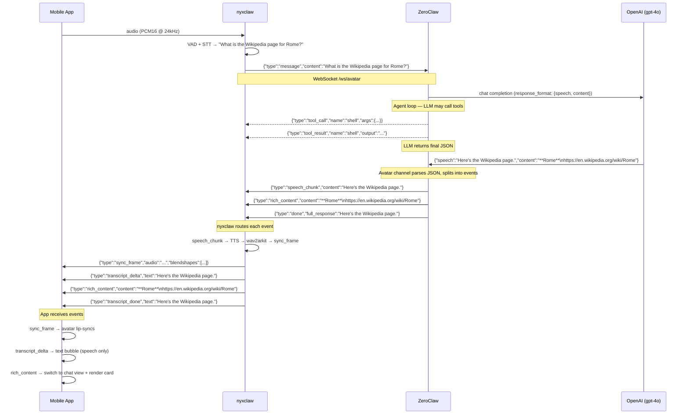

# Rich Content Flow — End-to-End

## Sequence Diagram

## Event Types

### ZeroClaw → nyxclaw (WebSocket /ws/avatar)

| Event | When | Payload |
|-------|------|---------|
| `tool_call` | LLM calls a tool during agent loop | `{"type":"tool_call","name":"shell","args":{...}}` |
| `tool_result` | Tool execution completes | `{"type":"tool_result","name":"shell","output":"...","success":true}` |
| `speech_chunk` | Parsed speech sentence from final response | `{"type":"speech_chunk","content":"Here's the Wikipedia page."}` |
| `rich_content` | Parsed content from final response (non-empty) | `{"type":"rich_content","content":"**Rome**\nhttps://..."}` |
| `done` | Turn complete | `{"type":"done","full_response":"Here's the Wikipedia page."}` |

### nyxclaw → Mobile App (WebSocket /ws)

| Event | When | Payload |
|-------|------|---------|
| `sync_frame` | Audio + blendshapes ready | `{"type":"sync_frame","audio":"...","blendshapes":[...]}` |
| `transcript_delta` | Speech text streaming | `{"type":"transcript_delta","text":"Here's the Wikipedia page."}` |
| `rich_content` | Rich content to display | `{"type":"rich_content","content":"**Rome**\nhttps://..."}` |
| `transcript_done` | Speech text finalized | `{"type":"transcript_done","text":"Here's the Wikipedia page."}` |
| `audio_start` | TTS audio begins | `{"type":"audio_start"}` |
| `audio_end` | TTS audio ends | `{"type":"audio_end"}` |

## Current Bug

ZeroClaw's avatar channel event loop (nyxclaw.rs line 352) forwards raw `chunk` events
from `turn_with_events` directly to nyxclaw. These contain the full JSON string
`{"speech":"...","content":"..."}`. Then AFTER the turn completes, the channel parses the
final response and sends clean `speech_chunk` + `rich_content` events.

Result: nyxclaw receives BOTH raw JSON chunks AND clean speech_chunks. The transcript
shows both concatenated.

Fix: suppress `chunk` and `done` events in the event forwarding loop (line 352), since
the avatar channel handles parsing and event generation itself after turn completion.
